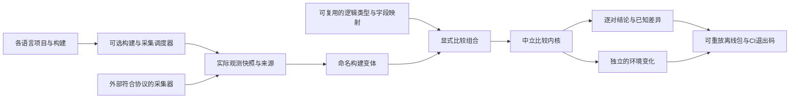

# Layout Compare：以比较为中心的第二轮设计

2026-09-28。此设计延续 [观测协议](cross-language-layout.md)，把产品入口收敛为：**同一逻辑数据，在不同语言实现、源码版本、构建和运行环境中的实际内存布局，有哪些可信差异？**

## 审查结论与修订

第一轮已能真实采集 C++ / C# 多种布局，但仍有五处妨碍这个目标：representation 被写成 native↔managed；映射重复绑定某一对快照；run 只有一个源码根；报告按快照枚举顺序排版；diff 缺少独立的构建条件变化。审查还发现运行时数组、inline 子关系、对象 extent 和占用范围校验会影响 same 的可信度。

本轮优先修复这些问题，并增加可重放的比较项目。保留现有采集器接口、pair manifest 和 run manifest。目录与 .NET 程序集保留 `layout-observer` / `LayoutObserver.*`，公开工具名称为 **Layout Compare**；Observer 专指观测层。

## 边界与数据流

比较内核不构建代码，不猜测编程语言，不自动认定同名类型等价。`native` / `managed` 描述观察视图而不是语言；representation 可比较这两种视图的任意组合。marshaled 仍须使用显式封送策略。

语言、编译器、运行时、目标和来源记录在快照 build。新增可选 `languages` 字符串数组；旧快照缺失时保持未知。metadata 变化单独放在 diff.context，不能作为布局变化或因果证明。端序等实际参与表示解释的事实仍由比较策略处理。

## 比较项目

project manifest 分三部分：

1. `variants`：命名变体 → 快照路径和 mapping ID。快照可以来自独立仓库、机器或 CI 构建。
2. `mappings`：每种实现的逻辑 case ID → 实际 observation；逻辑字段 ID → 实际 member。多个构建复用同一映射。
3. `comparisons`：显式左右变体、case 子集、mode、scope、policy。不会生成隐式全排列。

两端逻辑字段集合必须一致；实际字段增删时保留其期望 member 名，以便内核在完整枚举下判定增删。缺少映射是配置错误，不能变成成功。nested children 同时显式映射或沿用 pair 协议的同 ID 递归语义。映射不改变采集事实。

Core 只把项目编译为 pair manifests，不依赖文件系统。CLI `project` 导入并验证所有请求快照，逐对比较，保存原快照、展开映射、JSON diff、配对 HTML、index.html 与 result.json。导入完整时还生成仅引用包内快照的 project.json，搬移整个目录即可重放。输入缺失/损坏与比较失败保留在结果中，其他独立比较仍运行，最终退出 3。未知/不可比退出 2；完整差异退出 1；全部完整相同退出 0。输出目录必须全新。

## 来源与可信度

run 的每个 profile 可指定自己的 sourceRoot，缺省继承原顶层值。每个源码根覆盖 Git HEAD、index、非忽略工作树内容及递归 submodule；缺失子模块或不可读来源必须失败。所有源码根在运行期间保持稳定，产物 hash 在采集前后核对。

原始 collector build 完整保存在 `collectorProvenance`，调度器的核验范围写入 `captureProvenance`。`built-in-run` 仅说明配置的 buildSteps 在本次执行；它不是可验证构建的密码学证明，也不自动涵盖仓库外 SDK、系统头文件与依赖。未运行构建的来源关系明确为 unverified。project 导入不伪造任何来源补全。

报告以每个请求 case 为单位配对两端 observation，不依赖输入顺序；nested 只在其父关系下显示。已知事实、未知覆盖、构建条件分别呈现。

## 本轮验收

- 同视图跨实现映射可比较；native/managed 不再代替语言名。
- 多构建复用映射，显式 case 子集和嵌套映射生效；缺失输入、缺失映射、重复 ID 和覆盖不足不能通过。
- 比较包重放得到相同 JSON diff；不覆盖既有基准。
- 独立源码根保留各自身份；产物变化、源码变化、已 dirty 子模块变化都被发现。
- 运行时数组和 inline 图的坏事实被拒绝或保留未知；不会因缺少已知定长声明而误判已完整观测实例。
- 独立业务类型通过真实 C++ / C# Debug/Release 构建进入流程，包含一致结论与实际 packing 差异。
- 原有实际采集与 pair/run 工作流回归通过；新增行为完成独立审查。

扩大语言采集器、远程调度、数据库、Web 服务和自动类型猜测不属于本轮。新语言只需实现同一观测协议和映射即可进入比较；本轮没有声称验证 Rust/Java 采集器。
