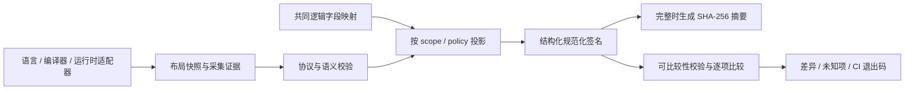

# 布局协议与规范化签名

2026-09-28。扩展边界是布局协议：C++、C# 和未来语言的适配器提供事实，共同内核负责校验、映射、规范化和比较。语言名称不参与内核分支。本文延续[比较项目设计](layout-compare-project.md)；具体字段与编码规则见[签名契约](../../tools/layout-observer/contracts/SIGNATURE.md)。

## 数据流与职责

快照不依赖比较对象。签名同样可以在每个构建流水线独立生成，之后按共同逻辑 case 选择比较对象。快照是原始观测；签名是指定比较规则下的规范化投影；摘要只用于索引和分组。保留结构化内容才能解释差异、复核摘要并处理部分未知的观察。

适配器可以使用自己的实现语言和采集机制，输出统一 JSON 即可。无需依赖公共内核的实现语言、修改比较算法或实现 HTML 报告。直接生成签名的实现必须满足同一签名契约、验证规则与一致性测试；仅输出一个不可解释的 hash 不构成协议实现。

## 签名的相等关系

签名由格式版本、策略、范围、共同逻辑字段结构和规范化布局共同定义，不存在每个源类型唯一的万能指纹。

在两端比较前提成立、所需事实完整、逻辑映射有效的条件下，规范化内容相等当且仅当共同比较器判定 `same`。端序与策略要求的字段表示进入布局内容；语言、编译器版本、构建标签、证据方法和显示名保留为来源，不污染布局相等关系。

`native` / `managed` / `marshaled`、根及内嵌观察上下文、原点和封送 profile 仍属于比较门槛。跨视图的 representation 可以相同，而 regression 要求同视图。因此这些门槛不能简单全部加入布局摘要，也不能丢弃。即使摘要相同，前提不成立仍不能判定 `same`。

未知事实不能编码成零、空字符串或“双方都有 unknown 所以相同”。只有选定策略要求的事实完整时才能生成用于布局分组的摘要。部分观察仍保存已知布局，并能报告确定差异；它不会因为出现未知项而吞掉已知差异。

## 映射与结构

源类型和成员 ID 是快照局部身份。每端独立把物理字段映射到共同逻辑字段。例如 C++ `count` 与 C# `_count` 可映射为同一逻辑 `count`，物理名称不进入该逻辑字段的签名。不能把两份不同的 mapping 文件 hash 当作共同逻辑结构的身份。

成员树保持嵌套、基类角色和实际子对象上下文；不能为便于 hash 而将其任意展平。字段名可能包含点、方括号、斜杠和非 ASCII 字符，规范化结构必须保持边界，不允许拼接路径造成身份碰撞。自动匹配字段与显式逻辑字段之间的冲突必须有确定且不丢字段的处理。

同一完整枚举下，实际存在与不存在的字段可以报告增删；显式选择器在双方都不存在仍是配置错误。独立签名生成阶段不知道另一侧，因此相应选择器信息必须保留到比较阶段。未知枚举下的缺失不能冒充已确认不存在。

引用只描述引用槽本身，不能把引用目标展开成内联对象。数组按当前观察长度与维度解释；实例签名不证明该类型在任意长度下相同。重叠区间规范化为并集；不读取 padding 字节、对象地址和字段实例值。

## 接入与版本演进

新增适配器需要：

1. 输出符合快照协议的数据，记录真实构建与采集证据；未知与不支持必须明确表达。
2. 声明实际能力，并通过所声明能力的采集 oracle；“可通过 JSON Schema”不证明测量正确。
3. 通过公共语义验证和签名一致性向量，验证与现有语言观察可映射比较。

只支持值布局的适配器可以接入，对象请求则明确不支持。现有表示模型足以表达新语言时不修改协议。出现新的必需表示语义时增加受版本控制的能力与规则；旧读者必须拒绝未知必需内容，不能静默跳过后产生 `same`。

首次签名协议沿用现有 scope/policy，不增加“只看几何”的策略、不推断字段拆分合并关系、不把布局相同提升为 ABI、序列化、对象生命周期或内存复制安全保证。未来可增加独立 geometry policy，但其签名不能冒充 representation 相等。

旧 TypeLayout `get_layout_signature<T>()` 和 admission 保持原有语义。旧签名展平部分嵌套和基类、折叠字节数组，并具有独立的架构、对齐及 opaque 规则；新签名不能直接复用旧字符串或从中恢复被丢弃的信息。

## 验收

- 同一观察独立导出，不依赖另一侧或比较执行顺序。
- 共同映射下的跨语言布局具有相同规范化内容；实际偏移、大小、表示、端序等变化产生差异。
- 键序、成员枚举顺序、区间分片、证据和构建标签不改变相应布局摘要。
- 策略决定 alignment/stride 是否参与；对象与封送门槛保留。
- Int64 超过 2^53 后仍精确，Unicode 与特殊字段名不发生结构或编码碰撞。
- 未知、opaque、缺失内联观察、不兼容上下文不能通过摘要变成 `same`。
- 签名导入重新校验内容、完整性与摘要；损坏、未知版本、重复字段或缺失必需内容被拒绝。
- 独立签名比较与原快照比较在对应 manifest 下保持结论一致，并验证实际 C++ / C# 构建产物的观察。
